# HY548: Assignment 1 - Docker 
## **Name:** Entisa Tzeortziana Komoritsan  
## **AM:** csdp1463 | **Email:** tzeortziana@csd.uoc.gr

# Exercise 1
### a) Download the images tagged 1.29.5 and 1.29.5-alpine locally.
* I pulled the NGINX images using the following commands:
    * **Command**: `docker pull nginx:1.29.5`
    * **Command**: `docker pull nginx:1.29.5-alpine`  
    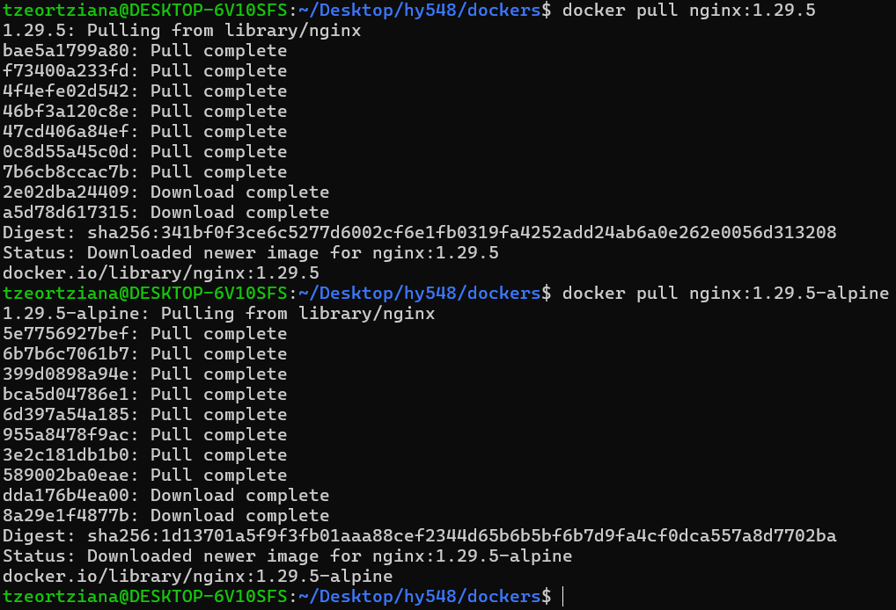

### b) Compare the sizes of the two images.
 * I compared the sizes using the `docker images` command:
    * **nginx:1.29.5**: 240MB
    * **nginx:1.29.5-alpine**: 93.4MB
    * The Alpine version is significantly smaller because it is based on Alpine Linux, a security-oriented, lightweight Linux distribution.  
    

### c) Start nginx:1.29.5 in the background, with the appropriate network settings to forward port 80 locally at port 8000 and use a browser (or curl or wget) to see that calls are answered. What is the answer?
* I started the container in detached mode with port 8000 mapped to port 80:
    * **Command**: `docker run -d -p 8000:80 nginx:1.29.5`
    * **Answer**: Accessing `curl localhost:8000` returns the standard HTML "Welcome to nginx!" page.  
    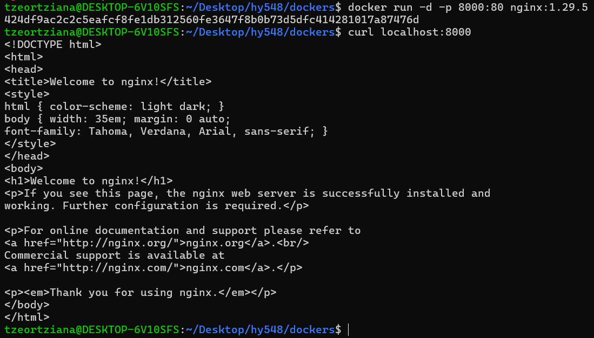

### d) Confirm that the container is running in Docker.
* I used `docker ps` to verify the container was running.  
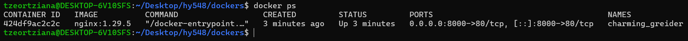

### e) Get the logs of the running container.
* I retrieved the logs to see the server initialization and requests:
    * **Command**: `docker logs [CONTAINER_ID]` --> `docker logs 424d`  
    

### f) Stop the running container.
* **Stop**: `docker stop [CONTAINER_ID]` --> `docker stop 424d`  
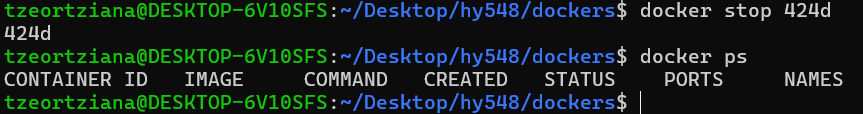

### g) Start the stopped container.
* **Start**: `docker start [CONTAINER_ID]` --> `docker start 424d`  
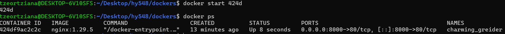

### h) Stop the container and remove it from Docker.
* I stopped and then permanently removed the container from the system.   
    * **Command**: `docker stop 424d`
    * **Command**: `docker rm 424d`  
    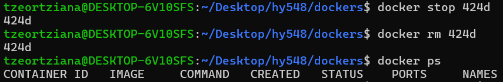

  

# Exercise 2

### a) Open a shell session inside the running container and change the first sentence of the default page to "Welcome to MY nginx!". Close the session. Validate the change.
* I entered the running container and modified the index file:
    * **Enter container**: `docker exec -it web bash`
    * **Edit text**: `sed -i 's/Welcome to nginx!/Welcome to MY nginx!/g' /usr/share/nginx/html/index.html`
    * **Verification**: `curl localhost:8000` confirmed the title changed to "Welcome to MY nginx!".  
      
    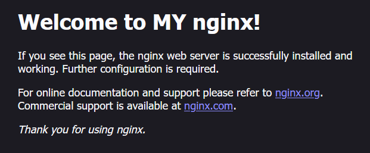

### b) From your computer's terminal (outside the container) download the default page locally and upload another one in its place. Validate the change.
* I used `docker cp` to manage files from the host terminal:
    * **Download**: `docker cp web:/usr/share/nginx/html/index.html default_index.html`
    * **Create local file**: `echo '<h1>This is my new page</h1>' > new_index.html`
    * **Upload**: `docker cp new_index.html web:/usr/share/nginx/html/index.html`
    * **Verification**: `curl localhost:8000` showed the new header.  
    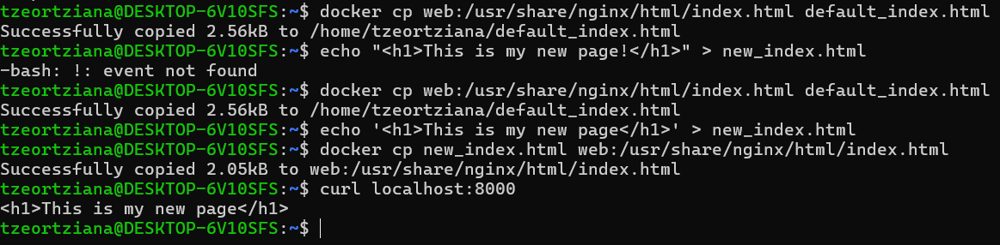

### c) Close the container, delete it and start another instance. Do you see the changes? Why?
* I tested what happens when the container is replaced:
    * **Stop and Remove**: `docker stop web` and `docker rm web`
    * **Start new instance**: `docker run -d -p 8000:80 --name web2 nginx:1.29.5`
    * **Observation**: The changes were gone, and the original "Welcome to nginx!" page returned.
    * **Why**: Containers are ephemeral (temporary) and stateless by design. When I uploaded the new index.html file, it was saved into the container's temporary "read/write layer". When I deleted the container using docker rm, that temporary layer was permanently destroyed along with my file. The new instance (web2) started fresh from the original, unmodified read-only nginx:1.29.5 image, which still has the default Nginx page.  
    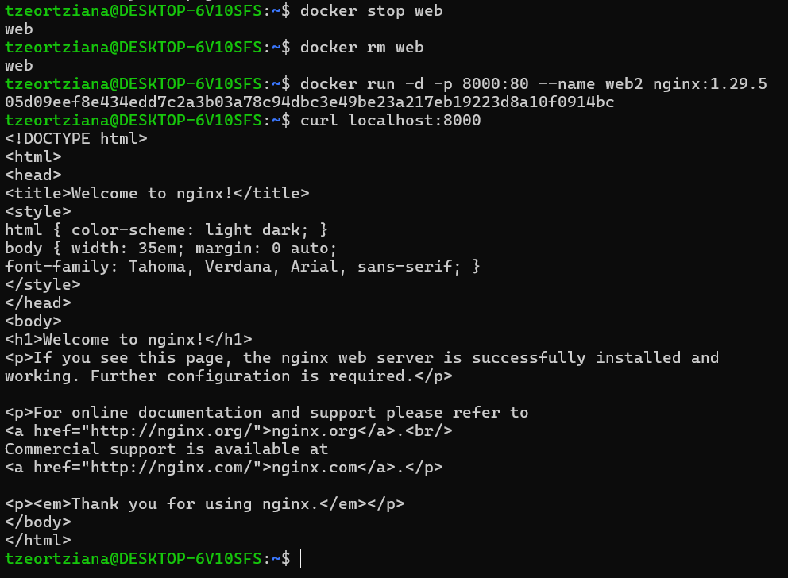

### d) Start an Nginx container to serve the page from the local folder instead of the default page. Validate that the correct content is served.
* I served content directly from a local folder to ensure persistence:
    * **Create local setup**: `mkdir my_website`, `cd my_website`, and `echo '<h1>This page is served directly from my local folder</h1>' > index.html`
    * **Command**: `docker run -d -p 8000:80 --name web3 -v $(pwd):/usr/share/nginx/html nginx:1.29.5`
    * **Verification**: `curl localhost:8000` served the local file.  
    

  

# Exercise 3

### a) Create the container image. Explain how much bigger your own image is compared to the image you were based on. Why?

* The Dockerfile was extended to include `vim-tiny` and a volume for the database:  
    

* To create the image, I ran the following command in the directory containing the Dockerfile:
    * **Command:** `docker build -t my-django-app .`
    

* **Size:** My image is 1.55GB, which is ~0.54GB larger than the base image. This increase is due to the layered architecture adding system tools, Python dependencies, and the application source code.
    * **Command:** `docker images`  
    

### b) Start the extended container twice, one with "debug mode" enabled and one without (set DJANGO_DEBUG=0). Validate that both are running and serving different content. What do you see?
* I ran two separate instances of the container with different environment settings to observe the output differences:  
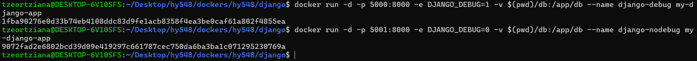

* **Debug ON**
    * **Command**: `docker run -d -p 5000:8000 -e DJANGO_DEBUG=1 --name django-debug my-django-app` 
    * **Result**: Accessing a non-existent URL displays a detailed "Page not found (404)" error page. This page includes the URLconf defined in the app, the specific URL patterns tried, and an explicit note that `DEBUG = True` is set in the settings.  
    

* **Debug OFF**
    * **Command**: `docker run -d -p 8001:8000 -e DJANGO_DEBUG=0 --name django-nodebug my-django-app` 
    * **Result**: Displays a simple, generic "Not Found" message stating "The requested resource was not found on this server." 
    

### c) Upload the image to your Docker Hub account.
* To upload the image to Docker Hub, I followed these steps:
    * I authenticated my local terminal with my Docker Hub account: 
        * **Command:** `docker login`  
    * I created a new name for the image that includes my Docker Hub username:
        * **Command:** `docker tag my-django-app tzeortziana/my-django-app:v1`
    * I uploaded the image to the cloud registry:
        * **Command:** `docker push tzeortziana/my-django-app:v1`  
          
        

  

# Exercise 4

* I created a GitHub Action to automate the build and push process for the Django application.
    * **Repository Setup:** I forked the original repository to my personal GitHub account (`Tzeortziana/hy548`) and cloned it locally to my WSL environment. GitHub requires workflow files to be located in a specific hidden directory (`.github/workflows/`). I performed the following commands:
        * Create the workflow directory:
            * **Command:** `mkdir -p .github/workflows`
        * Create and edit the workflow file
            * **Command:** `nano .github/workflows/docker-publish.yml`
            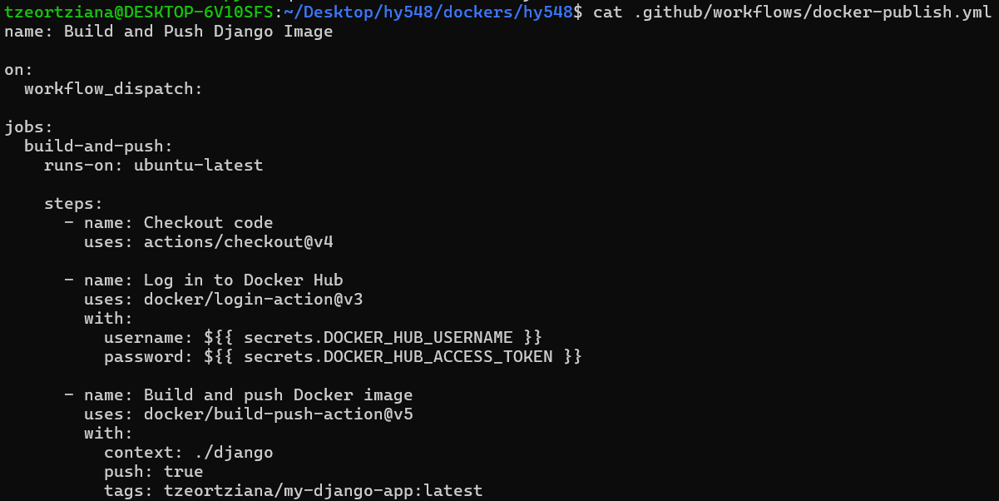  

    * **Secrets Management** In accordance with security best practices, I avoided hardcoding sensitive credentials. Instead, I navigated to **Settings → Secrets and variables → Actions** in the GitHub repository and configured the following secrets:

        * `DOCKER_HUB_USERNAME`: Stores my Docker Hub account name.
        * `DOCKER_HUB_ACCESS_TOKEN`: Stores a Personal Access Token (PAT) rather than a password.

    * I used Git to track the new directory and push it to the remote repository.  
      
      
    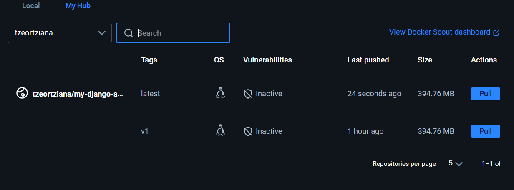

   