# Assignment 2: Kubernetes
## **Course:** CS-548 Cloud-native Software Architectures  
## **Name:** Entisa Tzeortziana Komoritsan
## **AM:** csdp1463 | **email:** tzeortziana@csd.uoc.gr


## Exercise 1

### Provide the YAML that runs a Pod with Nginx 1.29.5-alpine

**Manifest (`nginx-pod.yaml`):**
```yaml
apiVersion: v1
kind: Pod
metadata:
  name: nginx-pod
  labels:
    app: nginx
spec:
  containers:
  - name: nginx
    image: nginx:1.29.5-alpine
    ports:
    - containerPort: 80
      name: http
      protocol: TCP
```

### 1a. Install the manifest on Kubernetes and start the Pod

* **Command:** `kubectl apply -f nginx-pod.yaml`  
  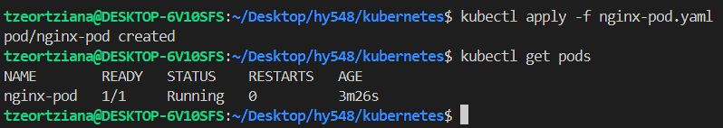


### 1b. Forward port 80 locally and answer the question

* **Command:** `kubectl port-forward nginx-pod 8080:80`  
    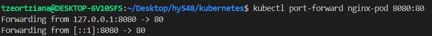

* **What is the answer?**  
The answer is the default Nginx welcome page HTML. When accessing the forwarded port, the web server returns a page with the *Welcome to nginx!* and a message confirming the web server is successfully installed.

* **Validation Command (in a separate terminal and in browser):**  
    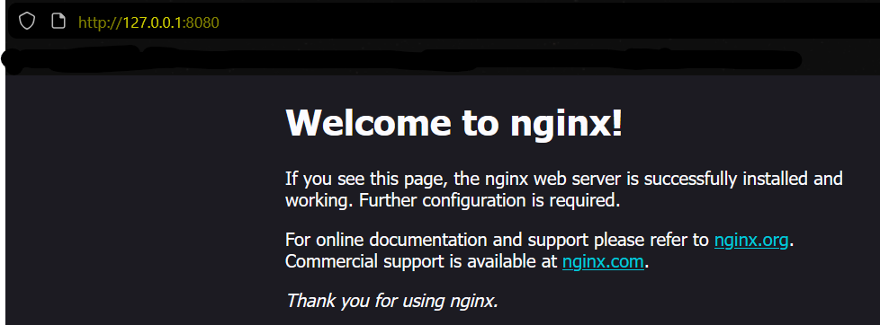  
    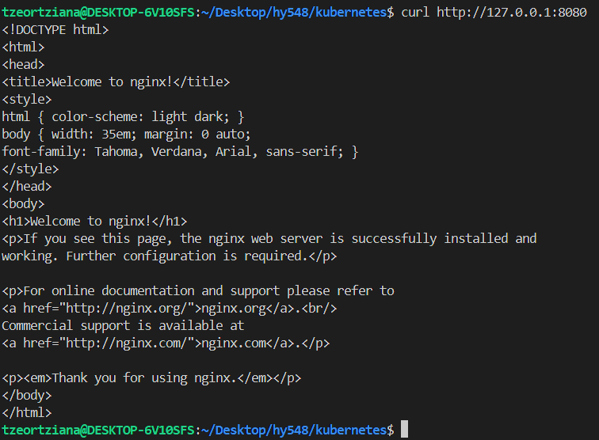


### 1c. See the logs of the running container

* **Command:** `kubectl logs nginx-pod`  
    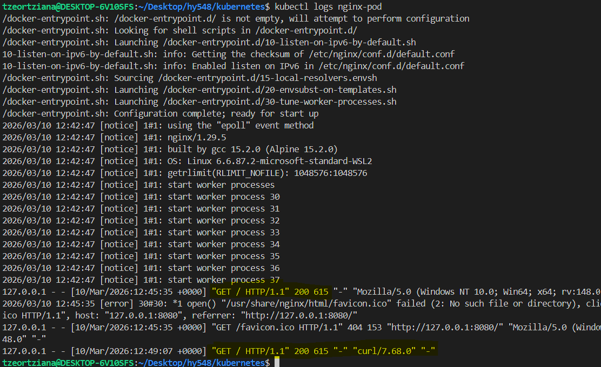


### 1d. Open a shell session inside the running container and change the first sentence of the default page to "Welcome to MY nginx!". Close the session. Validate the change.

* **Command:** `kubectl exec -it nginx-pod -- /bin/sh` : Opens an interactive shell inside the container    
* **Command:** `sed -i 's/Welcome to nginx!/Welcome to MY nginx!/g' /usr/share/nginx/html/index.html` : Changes the first sentence in the index.html file  
* **Command:** `curl [http://127.0.0.1:8080](http://127.0.0.1:8080)` : Validates the change locally  
  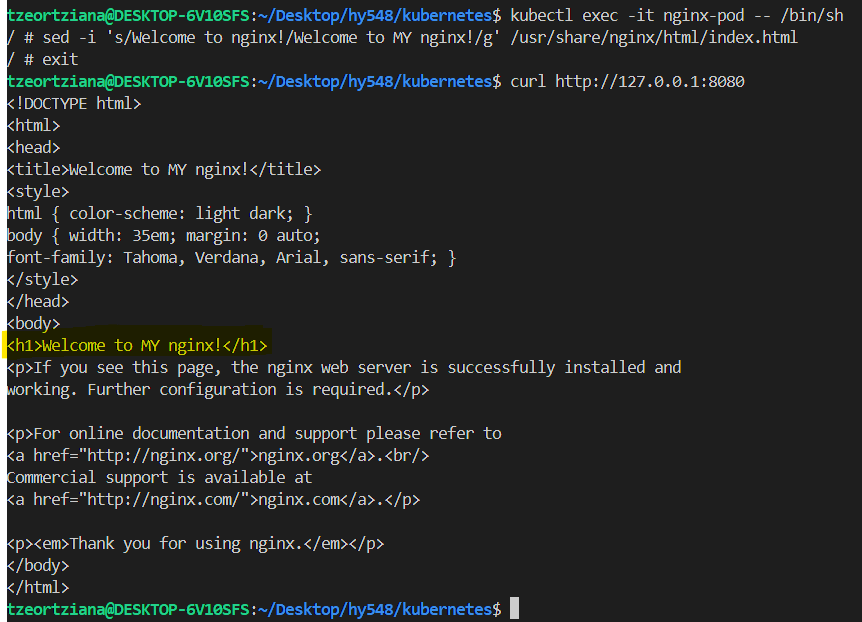
  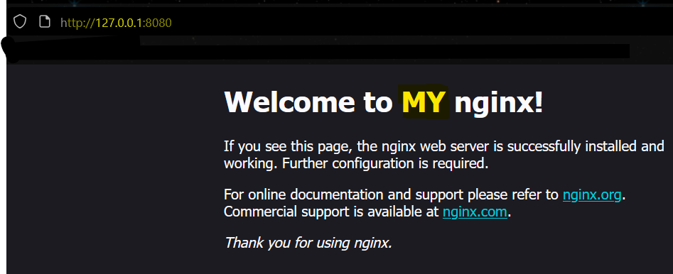

### 1e. From your computer terminal (outside the container), download the default page locally and upload another one in its place. Validate the change.

* **Command:** `kubectl cp nginx-pod:/usr/share/nginx/html/index.html ./index.html` : Downloads the file from the Pod to the local machine    
    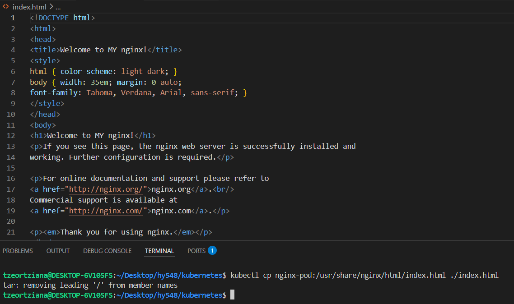  
* **Command:** `kubectl cp ./index.html nginx-pod:/usr/share/nginx/html/index.html` : Uploads the new file back to the Pod, overwriting the old one    
* **Command:** `curl [http://127.0.0.1:8080](http://127.0.0.1:8080)` : Validates the change locally    
  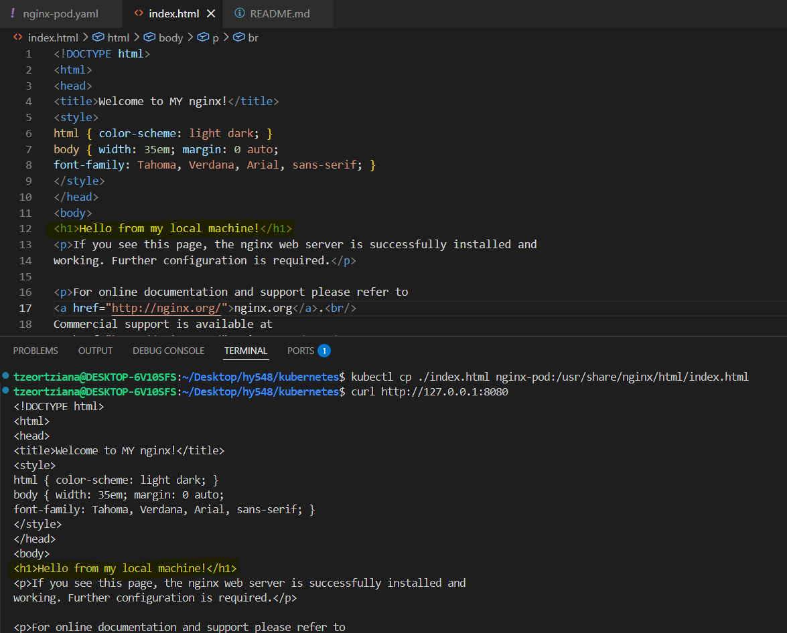


### 1f. Stop the Pod and remove the manifest from Kubernetes.

* **Command:** `kubectl delete pod nginx-pod`  


<hr style="border: 2px solid white;">  

## Exercise 2

### 2a. Provide a YAML that creates a Job using Ubuntu 24.04, which when started will run a script (defined in a ConfigMap) that will download the csd.uoc.gr site. Which command can you use to confirm that the Job completed successfully?

**Manifest (`job-download.yaml`):**
```yaml
apiVersion: v1
kind: ConfigMap
metadata:
  name: download-script
data:
  download.sh: |
    #!/bin/bash
    apt-get update && apt-get install -y wget
    mkdir -p /data
    wget -E -k -p -nH --cut-dirs=100 -P /data https://www.csd.uoc.gr/
---
apiVersion: batch/v1
kind: Job
metadata:
  name: site-downloader-job
spec:
  template:
    spec:
      containers:
        - name: ubuntu
          image: ubuntu:24.04
          command: ["/bin/bash", "/scripts/download.sh"]
          volumeMounts:
            - name: script-volume
              mountPath: /scripts
      restartPolicy: Never
      volumes:
        - name: script-volume
          configMap:
            name: download-script
            defaultMode: 0777
```
* **Command:** `kubectl apply -f job-download.yaml`: Apply the manifest to create the ConfigMap and start the Job  
    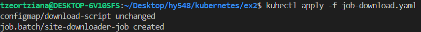  
* The primary command to confirm success is: `kubectl get jobs` Under the COMPLETIONS column, a successful job will show 1/1.  
   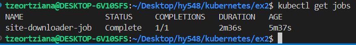 

* Since a Job creates a Pod to do the actual work, we can use `kubectl get pods`. For a Job, we are looking for the STATUS to change from Running or ContainerCreating to Completed.

* `kubectl describe pod site-downloader-job-vhm69`: It retrieves detailed information about a resource, including its configuration, status, and its Events.  
    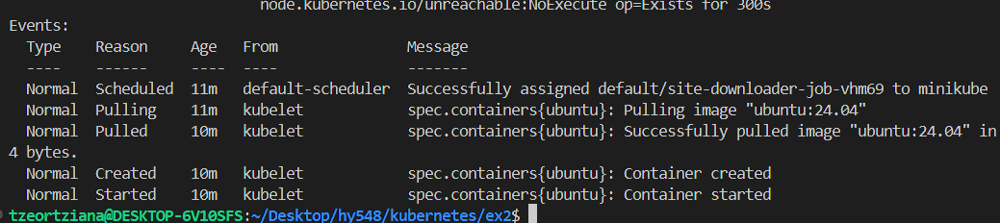 


### 2b. Extend the previous YAML with an Nginx Pod, a CronJob that will refresh the content every night at 2:15, as well as a volume so that the Nginx Pod will show the content downloaded by the Jobs instead of the default page. Briefly describe how data is communicated between containers.

**Manifest (`job-download.yaml`):**
```yaml
# Storage (persistant)

apiVersion: v1
kind: PersistentVolumeClaim
metadata:
  name: site-pvc
spec:
  accessModes:
    - ReadWriteOnce
  resources:
    requests:
      storage: 1Gi

---
# Scheduling (refresh at 2:15 AM)

apiVersion: batch/v1
kind: CronJob
metadata:
  name: site-refresh
spec:
  schedule: "15 2 * * *"
  jobTemplate:
    spec:
      template:
        spec:
          containers:
            - name: ubuntu-downloader
              image: ubuntu:24.04
              command: ["/bin/bash", "/scripts/download.sh"]
              volumeMounts:
                - name: script-volume
                  mountPath: /scripts
                - name: web-site-storage
                  mountPath: /data
          restartPolicy: OnFailure
          volumes:
            - name: script-volume
              configMap:
                name: download-script
                defaultMode: 0777
            - name: web-site-storage
              persistentVolumeClaim:
                claimName: site-pvc

---
# Nginx serving the shared data

apiVersion: v1
kind: Pod
metadata:
  name: nginx-server
spec:
  containers:
    - name: nginx
      image: nginx:1.29.5-alpine
      volumeMounts:
        - name: web-site-storage
          mountPath: /usr/share/nginx/html
  volumes:
    - name: web-site-storage
      persistentVolumeClaim:
        claimName: site-pvc

```
* **Command:** `kubectl apply -f exercise2b.yaml`: Applies the storage, the automation schedule, and the web server.  
    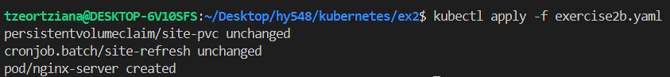  

* **Command:** `kubectl create job --from=cronjob/site-refresh manual-init-run`: Used to manually trigger the scheduled task for immediate verification.  
    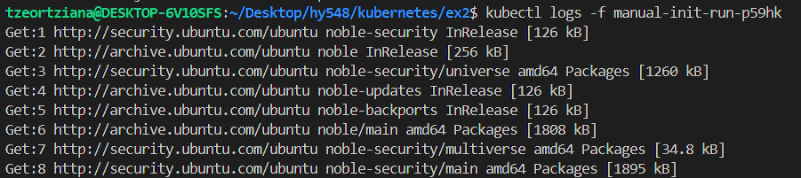  

* **Command:** `kubectl port-forward nginx-server 8081:80`: Forwards the Nginx server locally to validate the content is being served from the shared volume. 
     

* **Briefly describe how data is communicated between containers**  
Data is communicated between containers using a shared PersistentVolumeClaim (PVC). While containers are isolated by default, a PVC acts as a durable storage bridge. In this architecture, the CronJob Pod (Producer) mounts the PVC to write the downloaded website data, and the Nginx Pod (Consumer) mounts the same PVC to serve that content. This ensures data persistence independently of the Pods' lifecycles.


### 2c. Extend the previous YAML with an Nginx Pod, a CronJob that will refresh the content every night at 2:15, as well as a volume so that the Nginx Pod will show the content downloaded by the Jobs instead of the default page. Briefly describe how data is communicated between containers.

**Manifest (`job-download.yaml`):**
```yaml
apiVersion: apps/v1
kind: Deployment
metadata:
  name: nginx-deployment
spec:
  replicas: 1
  selector:
    matchLabels:
      app: nginx-web
  template:
    metadata:
      labels:
        app: nginx-web
    spec:
      initContainers:
        - name: install-and-download
          image: ubuntu:24.04
          command: ["/bin/bash", "/scripts/download.sh"]
          volumeMounts:
            - name: script-volume
              mountPath: /scripts
            - name: web-site-storage
              mountPath: /data
      containers:
        - name: nginx
          image: nginx:1.29.5-alpine
          volumeMounts:
            - name: web-site-storage
              mountPath: /usr/share/nginx/html

      volumes:
        - name: script-volume
          configMap:
            name: download-script
            defaultMode: 0777
        - name: web-site-storage
          persistentVolumeClaim:
           claimName: site-pvc
```
* **Command:** `kubectl apply -f exercise2c.yaml`  
    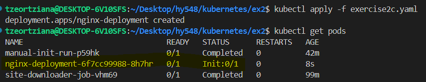  

* **Validation:**  
    * **Command:** `kubectl get pods -w`  
    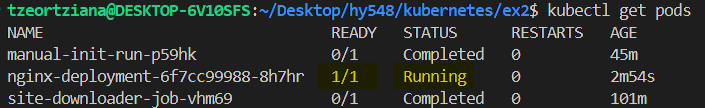

    * **Command:** `kubectl logs nginx-deployment-6f7cc99988-8h7hr -c install-and-download`  
    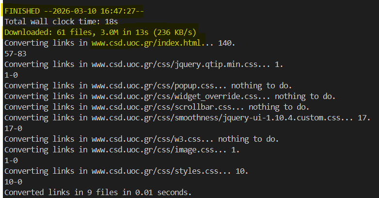

    * **Command:** `kubectl port-forward deployment/nginx-deployment 8082:80`  
      
    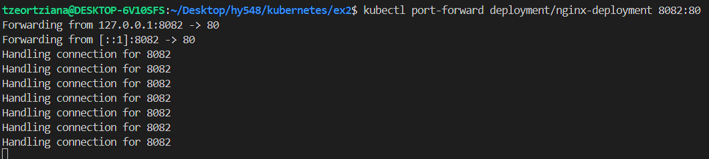  


<hr style="border: 2px solid white;">  

## Exercise 3


### 3a. Create your own container based on the Nginx one that will download a user-defined site on startup. Provide the Dockerfile and upload the image to your Docker Hub account.

**`entryponit.sh`:**
```bash
#!/bin/bash

TARGET_URL=${URL:-"https://www.csd.uoc.gr"}

echo "Downloading site: $TARGET_URL"

apt-get update && apt-get install -y wget
mkdir -p /usr/share/nginx/html

wget -E -k -p -P /usr/share/nginx/html -nH --cut-dirs=100 $TARGET_URL

nginx -g 'daemon off;'

```

**`Dockerfile`:**
```
FROM nginx:1.25

RUN apt-get update && apt-get install -y bash

COPY entrypoint.sh /entrypoint.sh
RUN chmod +x /entrypoint.sh

ENTRYPOINT ["/entrypoint.sh"]
```

On container startup, the script checks an environment variable named URL and uses wget to download the specified website directly into the Nginx document root `(/usr/share/nginx/html)`. This allows the same image to be reused for different sites simply by changing the environment variable.

* **Command:** `docker build -t tzeortziana/nginx-downloader:v1 .`

* **Command:** `docker push tzeortziana/nginx-downloader:v1`

* **Validation Command:** `docker logs test-csd`: See the wget activity inside test container
    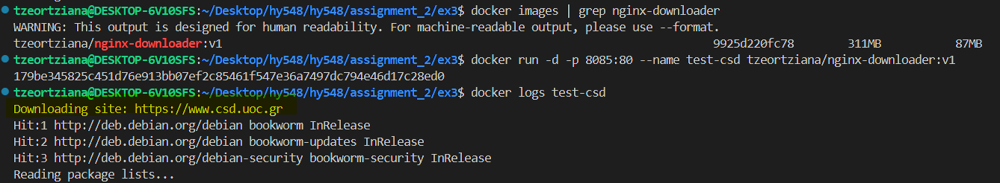  

* **Validation Command:** `docker run -d -p 8085:80 --name test-csd tzeortziana/nginx-downloader:v1`
      


### 3b. Provide a YAML that uses your custom container to run 2 Pods serving the csd.uoc.gr site in a Deployment, as well as a Service that allows the result to be externally accessible. Provide the commands needed to validate that it works with minikube (you may need to run minikube tunnel).

**Manifest (`exercise3b.yaml`):**
```yaml
apiVersion: apps/v1
kind: Deployment
metadata:
  name: csd-deployment
spec:
  replicas: 2
  selector:
    matchLabels:
      app: csd-web
  template:
    metadata:
      labels:
        app: csd-web
    spec:
      containers:
        - name: nginx-downloader
          image: tzeortziana/nginx-downloader:v1
          imagePullPolicy: Always
          env:
            - name: URL
              value: "https://www.csd.uoc.gr"
          ports:
            - containerPort: 80

---
apiVersion: v1
kind: Service
metadata:
  name: csd-service
spec:
  type: NodePort
  selector:
    app: csd-web
  ports:
    - port: 80
      targetPort: 80
      nodePort: 30080
```
* **Command:** `kubectl apply -f exercise3b.yaml`  
    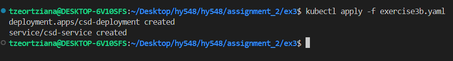  

* **Command:** `minikube tunnel` : in a second terminal  
    

* **Command:** `kubectl get pods -l app=csd-web` : check if they are ready  
    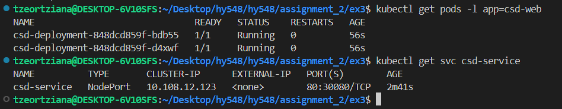

* **Command:** `minikube service csd-service` : Minikube automatically starts a tunnel to bridge the internal cluster network to 127.0.0.1  
      
    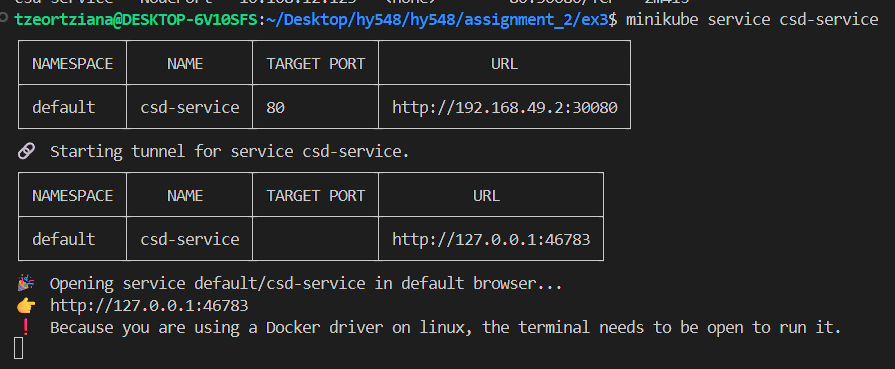  


### 3c. Extend the previous YAML with another Deployment/Service pair serving the math.uoc.gr site. Add an Ingress object that routes /csd to the first service and /math to the second. Provide the commands needed to validate that it works with minikube (you will need to enable the ingress addon).

**Manifest (`exercise3c.yaml`):**
```yaml
apiVersion: apps/v1
kind: Deployment
metadata:
  name: csd-deployment
spec:
  replicas: 2
  selector:
    matchLabels:
      app: csd-site
  template:
    metadata:
      labels:
        app: csd-site
    spec:
      containers:
        - name: csd-container
          image: tzeortziana/nginx-downloader:v1
          env:
            - name: URL
              value: "https://www.csd.uoc.gr"
---
apiVersion: v1
kind: Service
metadata:
  name: csd-service
spec:
  selector:
    app: csd-site 
  ports:
    - port: 80
      targetPort: 80
---
apiVersion: apps/v1
kind: Deployment
metadata:
  name: math-deployment
spec:
  replicas: 2
  selector:
    matchLabels:
      app: math-site
  template:
    metadata:
      labels:
        app: math-site
    spec:
      containers:
        - name: math-container
          image: tzeortziana/nginx-downloader:v1
          env:
            - name: URL
              value: "https://www.math.uoc.gr"
---
apiVersion: v1
kind: Service
metadata:
  name: math-service
spec:
  selector:
    app: math-site
  ports:
    - port: 80
      targetPort: 80
---
apiVersion: networking.k8s.io/v1
kind: Ingress
metadata:
  name: uoc-ingress
  annotations:
    nginx.ingress.kubernetes.io/rewrite-target: /
spec:
  ingressClassName: nginx
  rules:
    - http:
        paths:
          - path: /csd
            pathType: Prefix
            backend:
              service:
                name: csd-service
                port:
                  number: 80
          - path: /math
            pathType: Prefix
            backend:
              service:
                name: math-service
                port:
                  number: 80

```
* **Command:** `minikube addons enable ingress` : Enables the ingress controller  

* **Command:** `kubectl apply -f exercise3c.yaml` : Applies the multi-site configuration    

* **Command:** `minikube tunnel` : Starts the tunnel  
    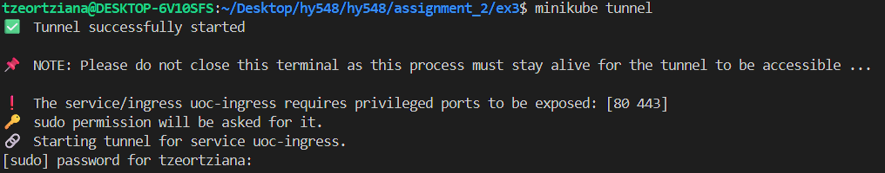

* **Verification Command:** `kubectl get pods`: Verify both CSD and Math pods are running  
* **Verification Command:** `kubectl get ingress`: Confirm the ingress is active   
    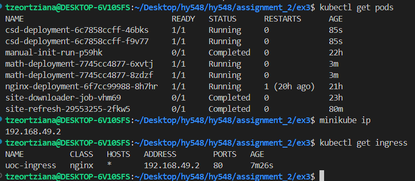

* **Validation:** Open browser at http://localhost/csd and http://localhost/math to verify path-based routing  
        