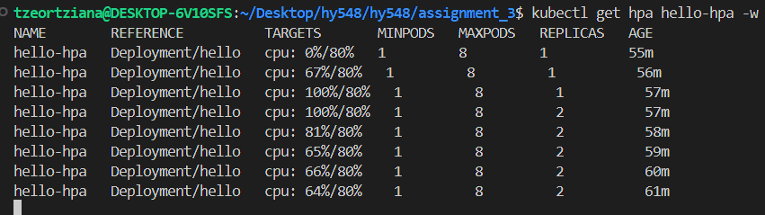
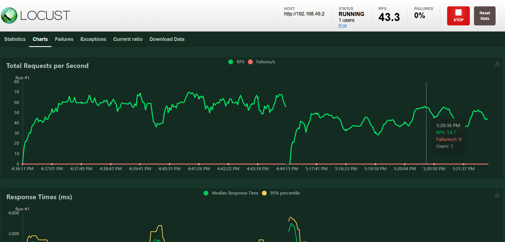
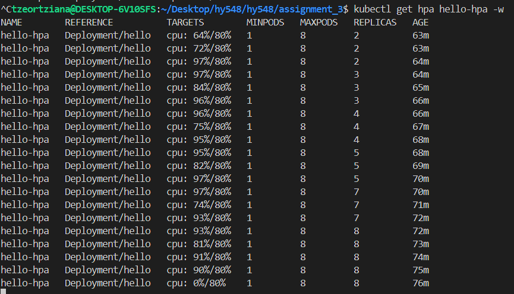
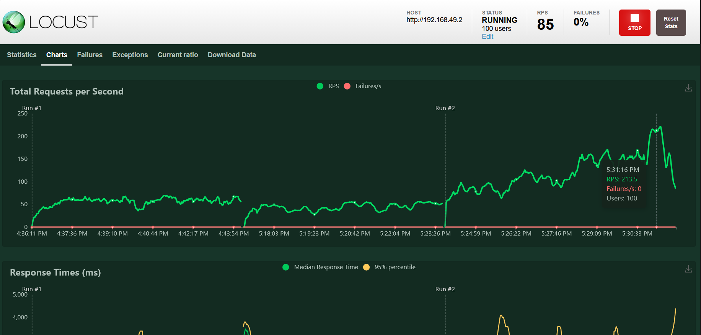
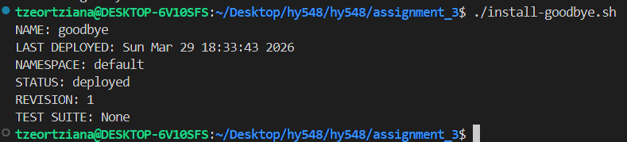
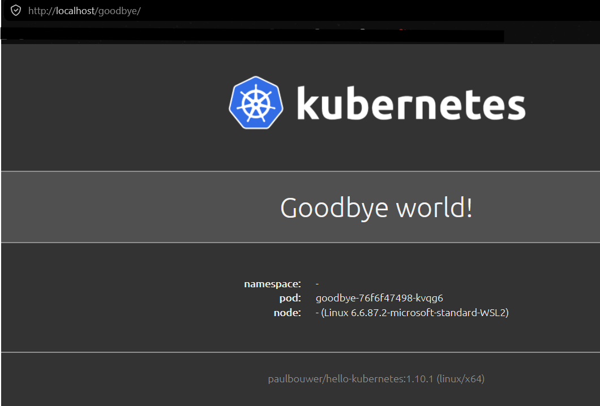
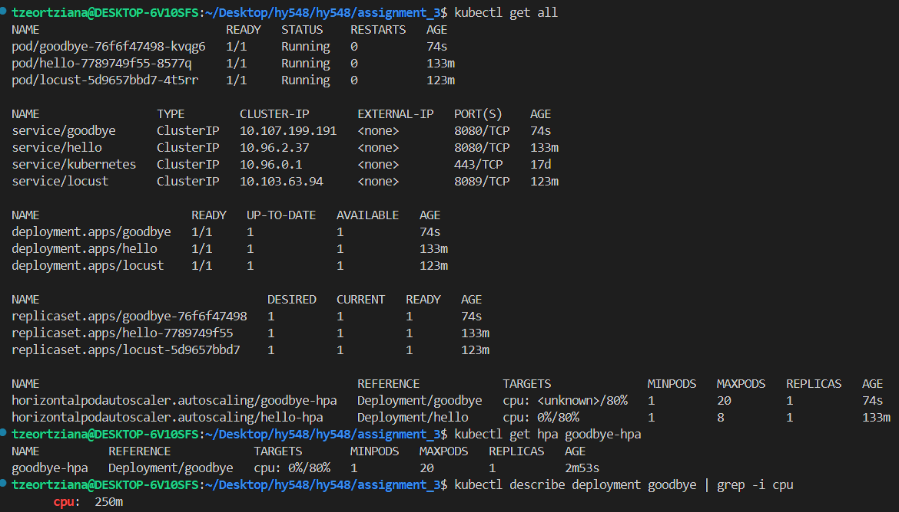
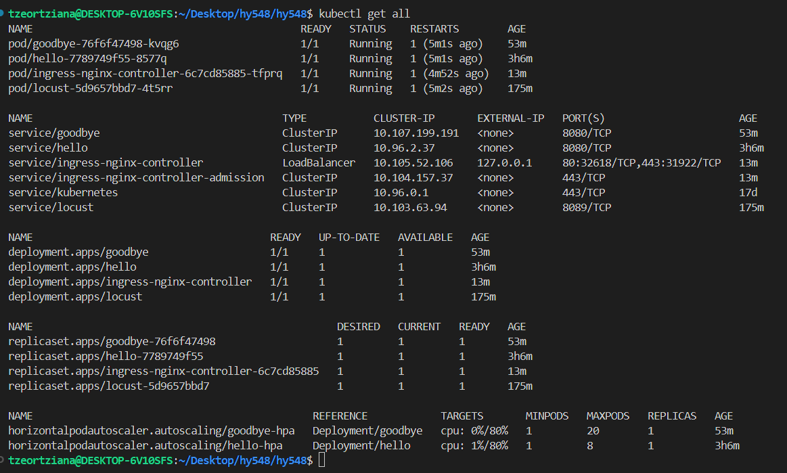
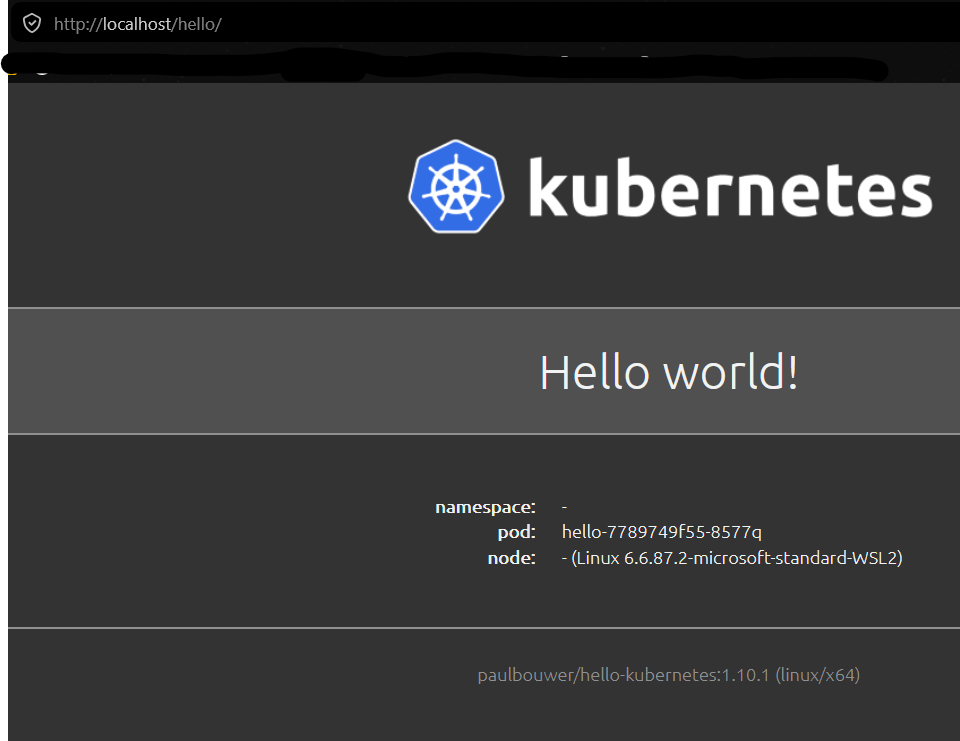

# Assignment 2: Kubernetes
## **Course:** CS-548 Cloud-native Software Architectures  
## **Name:** Entisa Tzeortziana Komoritsan
## **AM:** csdp1463 | **email:** tzeortziana@csd.uoc.gr


## Exercise 1

Find the YAML files here:   
- [hello-ingress.yaml](https://github.com/Tzeortziana/hy548/tree/master/assignment_3/ex1/hello-ingress.yaml)
- [locust.yaml](https://github.com/Tzeortziana/hy548/tree/master/assignment_3/ex1/locust.yaml)  


### 1a. To limit each Pod to a maximum of 20% CPU and 256MB RAM.
**`hello-ingress.yaml`:**
```yaml
# 1a - new resources limits:
        resources:              
          limits:
            cpu: "200m"
            memory: "256Mi"
```

### 1b. HorizontalPodAutoscaler Manifest
**`hello-ingress.yaml`:**
```yaml
--- # 1b - HorizontalPodAutoscaler 

apiVersion: autoscaling/v2
kind: HorizontalPodAutoscaler
metadata:
  name: hello-hpa
spec:
  scaleTargetRef:
    apiVersion: apps/v1
    kind: Deployment
    name: hello
  minReplicas: 1
  maxReplicas: 8
  metrics:
  - type: Resource
    resource:
      name: cpu
      target:
        type: Utilization
        averageUtilization: 80
```
### Testing

To deploy the modified application, enable the required metrics, and perform the HTTP benchmark using Locust, I run these commands:
```bash
minikube start
minikube addons enable metrics-server
kubectl apply -f hello-ingress.yaml
kubectl apply -f locust.yaml
kubectl port-forward svc/locust 8089:8089
kubectl get hpa hello-hpa -w
```

On another terminal:
```bash
minikube tunnel
```

**Test A: 1 Client**
- Maximum Requests Per Second: The service handled approximately 54.7 RPS.
- The single user generated enough load to push the CPU utilization to 100% (exceeding the 80% target). The scaling stopped at 2 containers.  
  


**Test B: 100 Clients**
- Maximum Requests Per Second: With increased concurrency, the service handled a peak of approximately 213.5 RPS.
-  The massive spike in traffic pushed the CPU well over the target. The HPA successfully scaled the deployment until it hit the hard limit defined in the manifest. The scaling stopped at 8 containers. Even though the load remained slightly above the 80% target, the HPA could not provision more resources due to the configuration constraints.    
  



## Exercise 2

### Following on from the previous exercise, create a Helm chart for your modified "hello world" service.

The chart was configured to use `values.yaml` to parameterize the application name, message, endpoint, resource limits, and HPA maximum replicas. Here: [**Helm Chart (hello-chart)**](https://github.com/Tzeortziana/hy548/tree/master/assignment_3/ex2/hello-chart)

### Installation commands:
```bash
helm install goodbye ./hello-chart \
  --set appName="goodbye" \
  --set message="Goodbye world!" \
  --set endpoint="/goodbye" \
  --set resources.cpu="250m" \
  --set autoscaler.maxReplicas=20
```
A runnable bash script of this command, [install-goodbye.sh](https://github.com/Tzeortziana/hy548/tree/master/assignment_3/ex2/install-goodbye.sh), is also included in the repo.  


When i access http://localhost/goodbye:  


**Results of:** `kubectl get hpa goodbye-hpa`, `kubectl describe deployment goodbye | grep -i cpu` and `kubectl get all`  



## Exercise 3

Default addon was disabled:
```bash
minikube addons disable ingress
```

Nginx Ingress Controller was installed via Helm:
```bash
helm repo add ingress-nginx https://kubernetes.github.io/ingress-nginx
helm repo update
helm install ingress-nginx ingress-nginx/ingress-nginx
```

To verify the new Ingress Controller, I redeployed the Yaml from Exercise 1.

I added in `hello-ingress.yaml` the line:  `ingressClassName: nginx` to the `spec` section of the `Ingress manifest`.

```yaml
apiVersion: networking.k8s.io/v1
kind: Ingress
metadata:
  name: hello-ingress
spec:
  ingressClassName: nginx   # <-- 
  rules:
  - http:
      paths:
      - path: /hello
        pathType: Prefix

```
Updated `hello-ingress.yaml` here: [hello-ingress.yaml](https://github.com/Tzeortziana/hy548/tree/master/assignment_3/ex3/hello-ingress.yaml)

### Testing:

In terminal: `kubectl get all`    


In http://localhost/hello/ :  

