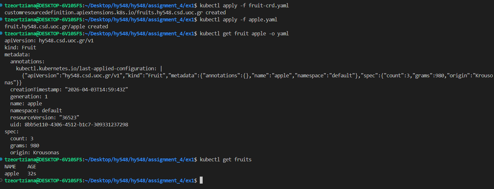

# Assignment 4
## **Course:** CS-548 Cloud-native Software Architectures  
## **Name:** Entisa Tzeortziana Komoritsan
## **AM:** csdp1463 | **email:** tzeortziana@csd.uoc.gr

## Exercise 1

Find the YAML files here:   
- [fruit-crd.yaml](https://github.com/Tzeortziana/hy548/tree/master/assignment_4/ex1/fruit-crd.yaml)
- [apple.yaml](https://github.com/Tzeortziana/hy548/tree/master/assignment_4/ex1/apple.yaml)  

**Commands:**

1a. Install the custom resource:
```bash
kubectl apply -f fruit-crd.yaml
```

1b. Create the above instance:
```bash
kubectl apply -f apple.yaml
```

1c. Return the new instance in YAML format:
```bash
kubectl get fruit apple -o yaml
```

1d. Return a list of all available instances:
```bash
kubectl get fruits
```

**Results in terminal:**  
